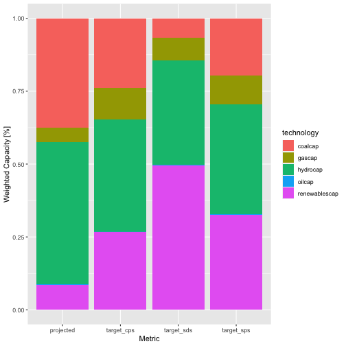

```{r setup, include=FALSE}
knitr::opts_chunk$set(
  echo = TRUE,
  collapse = TRUE,
  comment = "#>"
)
```

_This post comes from <https://jdhoffa.github.io/blog/r2dii-suite-is-now-on-cran/>._

---

The core suite of r2dii packages ([r2dii.data](https://2degreesinvesting.github.io/r2dii.data/), [r2dii.match](https://2degreesinvesting.github.io/r2dii.match/) and [r2dii.analysis](https://2degreesinvesting.github.io/r2dii.analysis/)), are now published on CRAN!

The r2dii suite was developed to implement the core functionality of the [Paris Agreement Capital Transition Assessment (PACTA)](https://www.transitionmonitor.com/) in R. PACTA is a methodology which allows financial institutions to aggregate climate-related data associated to their portfolios, and compare the result against climate scenarios.

## Installation

You can easily install all three packages directly from CRAN using:

```r
install.packages(
  c(
    "r2dii.data", 
    "r2dii.match", 
    "r2dii.analysis"
    )
  )
```

To get the latest development version of each of the packages, you can install directly from GitHub using:

```r
devtools::install_github("2DegreesInvesting/r2dii.data")
```

**Warning: Development versions are experimental and may be unstable. Proceed with caution.**

## r2dii.data

[r2dii.data](https://2degreesinvesting.github.io/r2dii.data/) provides a series of fake datasets. These are mainly meant to be used as a tool to learn how the methodology works, and also to provide an easy sandbox for testing. The built-in `data_dictionary` provides a view of all datasets in the package, along with variable definitions.

```r
library(dplyr)
library(r2dii.data)

data_dictionary %>%
  distinct(dataset)
#> # A tibble: 13 x 1
#>    dataset                    
#>    <chr>                      
#>  1 ald_demo                   
#>  2 co2_intensity_scenario_demo
#>  3 data_dictionary            
#>  4 isic_classification        
#>  5 iso_codes                  
#>  6 loanbook_demo              
#>  7 nace_classification        
#>  8 naics_classification       
#>  9 overwrite_demo             
#> 10 region_isos                
#> 11 region_isos_demo           
#> 12 scenario_demo_2020         
#> 13 sector_classifications
```

Some of the most useful datasets are:

* `loanbook_demo`: a loanbook dataset which can be used as a template to format real loanbook/ portfolio data. 
* `ald_demo`: a so-called "asset-level" dataset, containing crucial climate data at the asset level. (eg. power-plant capacity data, automotive car production, steel company emission factors)
* `scenario_demo_2020`: a fake climate scenario, offering technology pathways that would likely limit warming to less than 2 degrees Celsius. 

## r2dii.match

[r2dii.match](https://2degreesinvesting.github.io/r2dii.match/) provides the tools necessary to match the counter-parties in a loanbook to the climate data of the assets that they own. 

Owing to the fact that many lending portfolios are exposed to mid- and small- size companies, which are often not publicly-listed, matching data can be tricky. To achieve these links, we have written wrappers around some common fuzzy matching algorithms, which play nicely with formatted `loanbook`'s and `ald`'s. 

You can run the matching algorithm on sample data provided by `r2dii.data`:

```r
library(r2dii.match)

matched <- match_name(loanbook_demo, ald_demo)

matched %>%
  select(name, sector, name_ald, sector_ald, score) %>%
  head()
#> # A tibble: 6 x 5
#>   name         sector     name_ald     sector_ald score
#>   <chr>        <chr>      <chr>        <chr>      <dbl>
#> 1 Aston Martin automotive aston martin automotive     1
#> 2 Avtozaz      automotive avtozaz      automotive     1
#> 3 Bogdan       automotive bogdan       automotive     1
#> 4 Ch Auto      automotive ch auto      automotive     1
#> 5 Chehejia     automotive chehejia     automotive     1
#> 6 Chtc Auto    automotive chtc auto    automotive     1
```

After the initial matching, you must manually verify which of the matches you would like to keep. To do so, simply save `matched` as a .csv, and open in excel or similar. If you would like to keep a match, write the `score` to `1`. If you don't want the match, leave the `score` as anything but `1`.

```r
matched %>%
  filter(score != 1) %>%
  arrange(desc(score)) %>%
  select(name, sector, name_ald, sector_ald, score) %>%
  head()
#> # A tibble: 6 x 5
#>   name                        sector   name_ald                           sector_ald score
#>   <chr>                       <chr>    <chr>                              <chr>      <dbl>
#> 1 Bhushan Energy Ltd.         power    bhagwan energy ltd.                power      0.906
#> 2 Cementos San Juan           cement   cemento sur                        cement     0.900
#> 3 Shandong Qiyin Cement Group cement   shangfeng cement group             cement     0.883
#> 4 Handong Shipbuilding Co Ltd shipping han dong                           shipping   0.856
#> 5 Hanil Express Co Ltd        shipping han sung line co ltd               shipping   0.853
#> 6 Nandi Roller Inc.           power    nandi roller flour mills pvt. ltd. power      0.851
```

The final step is to prioritize your matches. This ensures that the same loan isn't accidentally matched to multiple `ald` companies. 

Read the validated match file back into R and run: 

```r
match_result <- matched %>%
  prioritize()

match_result %>%
  select(name_direct_loantaker, loan_size_outstanding, sector, name_ald) %>%
  head()
#> # A tibble: 6 x 4
#>   name_direct_loantaker             loan_size_outstanding sector     name_ald                         
#>   <chr>                                             <dbl> <chr>      <chr>                            
#> 1 Shaanxi Auto                                     396377 automotive shaanxi auto                     
#> 2 Shandong Auto                                    319353 automotive shandong auto                    
#> 3 Shandong Kama                                    258105 automotive shandong kama                    
#> 4 Shandong Tangjun Ouling                          332345 automotive shandong tangjun ouling          
#> 5 Shanghai Automotive Industry Corp                203353 automotive shanghai automotive industry corp
#> 6 Shanxi Dayun                                     329561 automotive shanxi dayun
```

## r2dii.analysis

The final step is to analyze your matched dataset, and compare the results to a climate scenario. 

You can apply scenario targets to your loanbook data by calling: 

```r
library(r2dii.analysis)

portfolio_targets <- match_result %>%
  target_market_share(
    ald_demo,
    scenario_demo_2020,
    region_isos_demo
  )

portfolio_targets %>%
  head()
#> # A tibble: 6 x 7
#>   sector     technology  year region scenario_source weighted_production_metric   weighted_production_value
#>   <chr>      <chr>      <int> <chr>  <chr>           <chr>                                            <dbl>
#> 1 automotive electric    2020 global demo_2020       projected                                      148935.
#> 2 automotive electric    2020 global demo_2020       normalized_corporate_economy                   148935.
#> 3 automotive electric    2020 global demo_2020       target_cps                                     148935.
#> 4 automotive electric    2020 global demo_2020       target_sds                                     148935.
#> 5 automotive electric    2020 global demo_2020       target_sps                                     148935.
#> 6 automotive hybrid      2020 global demo_2020       projected                                      141768.
```

And you can plot the distribution of technologies using `ggplot2`:

```r
library(ggplot2)

portfolio_targets %>%
  filter(
    sector == "power",
    weighted_production_metric != "normalized_corporate_economy",
    year == max(year)
  ) %>% # different targets can be plotted by setting these filters
  group_by(technology) %>%
  ggplot(aes(
    x = weighted_production_metric, y = weighted_production_value, fill =
      technology
  )) +
  geom_col(position = "fill") +
  labs(
    x = "Metric",
    y = "Weighted Capacity [%]"
  )
```



