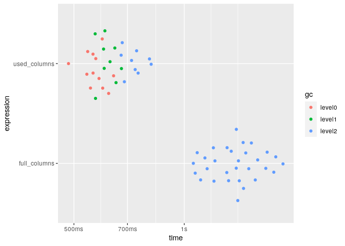

Working with big data
================
true
07-20-2020

Packages:

``` r
library(r2dii.data)
library(r2dii.match)
#> Warning: package 'r2dii.match' was built under R version 4.0.2
library(bench)
```

## Use less data

One way to save time and memory is to use less data. Even if you
downsize your data, you may achieve the exact same result, or achieve a
slighly different result that is equally informative.

### Use just the columns you need

Your datasets may have columns `match_name()` doesn’t need.

``` r
dim(loanbook_demo)
#> [1] 320  19

dim(ald_demo)
#> [1] 17368    14
```

`match_name()` needs only these columns:

``` r
lbk_crucial <- c(
  "sector_classification_system",
  "id_ultimate_parent",
  "name_ultimate_parent",
  "id_direct_loantaker",
  "name_direct_loantaker",
  "sector_classification_direct_loantaker"
)

ald_crucial <- c("name_company", "sector")
```

If you pick just what you need, you may be able to work with smaller
data.

``` r
lbk <- loanbook_demo[lbk_crucial]
dim(lbk)
#> [1] 320   6

ald <- ald_demo[ald_crucial]
dim(ald)
#> [1] 17368     2
```

These can use less time and memory:

``` r
benchmark <- bench::mark(
  check = FALSE,
  iterations = 30,
  full_columns = match_name(loanbook_demo, ald_demo),
  used_columns = match_name(lbk, ald)
)
#> Warning: Some expressions had a GC in every iteration; so filtering is disabled.

ggplot2::autoplot(benchmark)
```

<!-- -->
